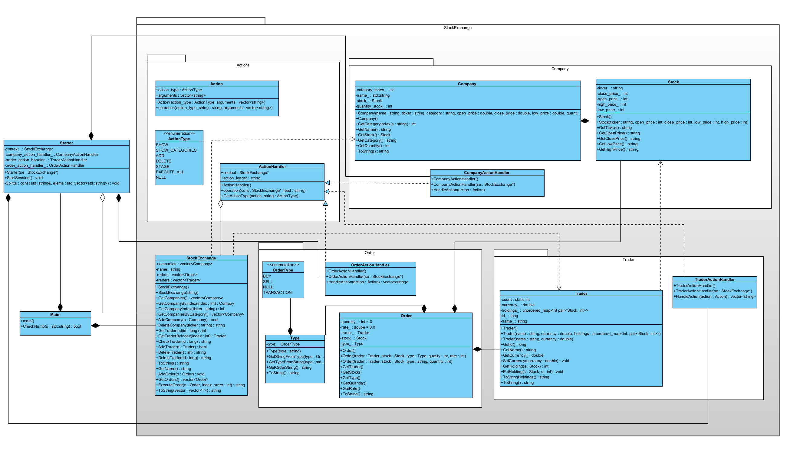

# Stock exchange

*С++ MIPT 2023*

>Authors
>>Lukashev Kirill
>
>>Borshcheva Elizabeth

## Description

This project represents a model of an exchange where there are companies and traders who make orders

The current functionality allows traders to make orders to buy shares from companies

The program receives a prescribed scenario of actions on the exchange, and then it executes it
## Project build
```bash
cd ~/Exchange #Create an empty directory for temporary files and go there
mkdir build
cd build
cmake ~/Exchange/ #Running the cmake command with the path to the folder with the sources
cmake --build .
```

## Project launch
```bash
./ExchangeCheck
```

## Model usage
* `COMPANY`
    * `SHOW` - Shows company with ticker ‘ticker’
    * `SHOW_CATEGORIES` - Shows all categories
    * `SHOW_CATEGORY` - Shows all companies with category
    * `ADD` - Adds and registers a company
    * `DELETE` - Deletes and unregisters a company
* `TRADER`
    * `SHOW` - Shows trader
    * `ADD` - Adds and registers a trader
    * `DELETE` - Deletes and unregisters a trader
* `ORDER`
    * `EXECUTE_ALL` - Executes staged orders if conditions are met
    * `STAGE` - Adds and stages a new order

## UML DIARGAM

